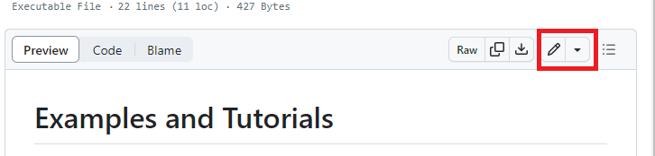

# How to contribute

I truly value any and all contributions. If you see some area you can improve, please do so.
If you plan to contribute, but do not have some issue or feature request in mind, you can choose one of the proposed themes in the [discussion section](https://github.com/AndyTheFactory/newspaper4k/discussions/categories/areas-in-need-for-your-contribution)

## Minor or trivial changes

Spelling, minor corrections or documentation changes or other improvements that do not imply code changes and testing:

- Clone or fork+clone repository
- Create a branch
- Commit and push change
- Open a pull request or merge request

## Documentation

Any additions to [Examples and Tutorials](https://newspaper4k.readthedocs.io/en/latest/user_guide/examples.html) are always welcome.

You can add your examples by fork+clone the repository, and edit the [docs/examples.rst](https://github.com/AndyTheFactory/newspaper4k/blob/master/docs/user_guide/examples.rst) file.
Add your example in the file, following the same format as the other examples.

Commit, push and create a pull request.

You can always do that also from github directly by using the edit button on the file. This will prompt you to fork the repository.


You can always improve any other areas of documentation. The documentation is written in [reStructuredText](https://www.sphinx-doc.org/en/master/usage/restructuredtext/basics.html) and can be found in the [docs](docs) folder. Api calls are self-documented through docstrings in the sourcecode.

When submitting a PR request, have in mind to change only the relevant part of the files. Reformatting the whole file will add a lot of noise to the PR.

## Adding languages

At the moment we are not integrating new languages, the language api will change.
You can still submit a PR with the language you want to add and we will merge it once the language api is stable.

## Submitting a PR

## PR Title Guidelines
In Newspaper4k, we adopt a structure inspired by the [conventional commit convention](https://www.conventionalcommits.org/en/v1.0.0/) for PR titles. Your PR title should conform to this format, encompassing the type of change, an optional scope, and a succinct description:

    <type>[optional scope]: <description>

Frequently used types include:

- `feat` (for enhancements)
- `bug` (for bug fixes)
- `docs` (for documentation updates)
- `test` (for test modifications)
- `perf` (for performance improvements)
- `refactor` (for code restructuring)

For changes that break backward compatibility (such as introducing a mandatory new parameter), append a `!` after the type to indicate the PR includes breaking changes.

Some scope examples could be:
- `parse` (for changes to the article extraction process)
- `doc` (for additions or changes to the documentation)
- `lang` (for changes or additions to language related code)
### Examples:

- `feat(nlp): integrate new article summarization algorithm`
- `bug(core): resolve threading issue in article download`
- `feat!: transition to async processing in extractors`

## PR Description Guidelines
When writing your PR description for Newspaper4k, please follow to [the provided pull request template](.github/pull_request_template.md). This template is designed to clearly and comprehensively outline your changes:

- **Issue Link**: Associate the PR with the relevant [issue](https://github.com/AndyTheFactory/newspaper4k/issues) it addresses.
- **Changes Overview**: Detail what is being changed in the PR.
- **Limitations**: If any, mention the limitations of your implementation.
- **Breaking Changes**: Clearly describe any breaking changes. Include examples showcasing the situation before and after the change.
- **Testing Approach**: Explain how the changes were tested to ensure reliability.

By following these guidelines, you help maintain clarity and consistency in the project's development process.


## Submitting an issue
Before submitting an issue, please check if it has already been reported (simply search for it :) ). Additionally, please check that:
- The article website you have troubles with is not paywalled [Docs - Paywall](https://newspaper4k.readthedocs.io/en/latest/user_guide/known_issues.html#paywall)
- The article website is not generating the webpage dynamically (e.g. using JavaScript) [Docs - Dynamic content](https://newspaper4k.readthedocs.io/en/latest/user_guide/known_issues.html#dynamic-content)
- The article website is not using a language that is not supported by newspaper4k [Docs - Supported languages](https://newspaper4k.readthedocs.io/en/latest/user_guide/languages.html)

Also, in any case, please provide the following information:
- The **URL of the article(s)** you are trying to parse
- The code you are using to parse the article
- The **error you are getting** (if any)
- The parsing result you are getting (if any)

## Proposing Significant Changes to Newspaper4k
Most modifications to Newspaper4k, including bug fixes and minor enhancements, are carried out via the standard Pull Request process, adhering to our contribution guidelines.

However, some changes are considered "significant," and these warrant a more thorough design process to ensure consensus and clarity before dedicating time to actual development. This includes new features or substantial refactorings.

If you believe your contribution falls under the following categories:

* Introducing a new feature that expands the existing API functionalities.
* Adding new components (such as parsers, extractors, NLP processing).
* Removing features already released in the current minor version.
* Undertaking a major refactoring that necessitates new tests or the inclusion of new dependencies.
* Implementing a change complex enough to necessitate a phased approach for completion.

Then **before starting any coding** please open an issue to discuss your proposal. This will help us avoid wasted effort and ensure that your contribution is in line with the project's roadmap.

## Setting up your development environment
<span id="setup">

### Prerequisites

Fork and clone the repo. From the terminal, run:

```bash
git clone https://github.com/<your-gh-username>/newspaper4k.git
```
Then move into the cloned folder, create a virtualenv, and perform an editable install.

```bash
# Move into the cloned folder
cd newspaper4k/

# Create a virtual environment
python3 -m venv venv

# Activate the environment
source venv/bin/activate

# Upgrade pip (very important!)
pip install --upgrade pip

# Install Newspaper4k in editable mode
pip install -e '.'
```

Last, install the pre-commit hooks with:

```bash
pre-commit install
```

`pre-commit` designed to execute certain tasks prior to every git commit operation. Going forward, when you commit changes in Newspaper4k, the output should resemble the following:

```bash
check python ast.....................................(no files to check)Skipped
check json...........................................(no files to check)Skipped
check for merge conflicts................................................Passed
check that scripts with shebangs are executable..........................Passed
check toml...........................................(no files to check)Skipped
check yaml...........................................(no files to check)Skipped
fix end of files.........................................................Passed
mixed line ending........................................................Passed
don't commit to branch...................................................Passed
trim trailing whitespace.................................................Passed
black-jupyter........................................(no files to check)Skipped
ruff.................................................(no files to check)Skipped
codespell................................................................Passed
update-requirements-txt..................................................Passed
```

This pre-commit hooks might fail. If that happens to you and you can't understand why, please do the following:

- Ask for help by opening an issue.
- As the last resort, if you are desperate and everything failed, ask Git to skip the hook with git commit --no-verify. This command will suspend all pre-commit hooks and let you push in all cases.
- In case of further issues pushing your changes, please uninstall the hook with `pre-commit uninstall -t pre-commit -t pre-push` and review your Git setup.
